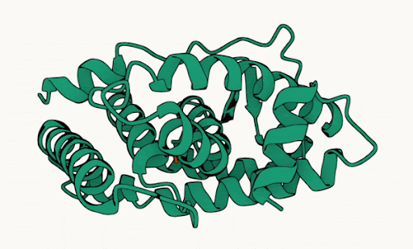
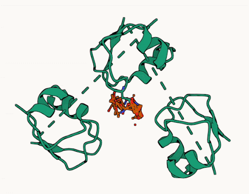

<div align="center">

# FlowDock

<a href="https://pytorch.org/get-started/locally/"></a>
<a href="https://pytorchlightning.ai/"></a>
<a href="https://hydra.cc/"></a>

<!-- <a href="https://github.com/ashleve/lightning-hydra-template"></a><br> -->

[](https://arxiv.org/abs/2412.10966)

<!-- [](https://papers.nips.cc/paper/2020) -->

[](https://doi.org/10.5281/zenodo.14660031)


</div>

## Description

This is the official codebase of the paper

**FlowDock: Geometric Flow Matching for Generative Protein-Ligand Docking and Affinity Prediction**

\[[arXiv](https://arxiv.org/abs/2412.10966)\]

<div align="center">




</div>

## Contents

- [Installation](#installation)
- [How to prepare data for FlowDock](#how-to-prepare-data-for-flowdock)
- [How to train FlowDock](#how-to-train-flowdock)
- [How to evaluate FlowDock](#how-to-evaluate-flowdock)
- [How to create comparative plots of evaluation results](#how-to-create-comparative-plots-of-evaluation-results)
- [How to predict new protein-ligand complex structures and their affinities using FlowDock](#how-to-predict-new-protein-ligand-complex-structures-using-flowdock)
- [For developers](#for-developers)
- [Docker](#docker)
- [Acknowledgements](#acknowledgements)
- [License](#license)
- [Citing this work](#citing-this-work)

## Installation

<details>

Install Mamba

```bash
wget "https://github.com/conda-forge/miniforge/releases/latest/download/Miniforge3-$(uname)-$(uname -m).sh"
bash Miniforge3-$(uname)-$(uname -m).sh  # accept all terms and install to the default location
rm Miniforge3-$(uname)-$(uname -m).sh  # (optionally) remove installer after using it
source ~/.bashrc  # alternatively, one can restart their shell session to achieve the same result
```

Install dependencies

```bash
# clone project
git clone https://github.com/BioinfoMachineLearning/FlowDock
cd FlowDock

# create conda environment
mamba env create -f environments/flowdock_environment.yaml
conda activate FlowDock  # NOTE: one still needs to use `conda` to (de)activate environments
pip3 install -e . # install local project as package
```

Download checkpoints

```bash
# pretrained NeuralPLexer weights
cd checkpoints/
wget https://zenodo.org/records/10373581/files/neuralplexermodels_downstream_datasets_predictions.zip
unzip neuralplexermodels_downstream_datasets_predictions.zip
rm neuralplexermodels_downstream_datasets_predictions.zip
cd ../
```

```bash
# pretrained FlowDock weights
wget https://zenodo.org/records/14660031/files/flowdock_checkpoints.tar.gz
tar -xzf flowdock_checkpoints.tar.gz
rm flowdock_checkpoints.tar.gz
```

Download preprocessed datasets

```bash
# cached input data for training/validation/testing
wget "https://mailmissouri-my.sharepoint.com/:u:/g/personal/acmwhb_umsystem_edu/ER1hctIBhDVFjM7YepOI6WcBXNBm4_e6EBjFEHAM1A3y5g?download=1"
tar -xzf flowdock_data_cache.tar.gz
rm flowdock_data_cache.tar.gz

# cached data for PDBBind, Binding MOAD, DockGen, and the PDB-based van der Mers (vdM) dataset
wget https://zenodo.org/records/14660031/files/flowdock_pdbbind_data.tar.gz
tar -xzf flowdock_pdbbind_data.tar.gz
rm flowdock_pdbbind_data.tar.gz

wget https://zenodo.org/records/14660031/files/flowdock_moad_data.tar.gz
tar -xzf flowdock_moad_data.tar.gz
rm flowdock_moad_data.tar.gz

wget https://zenodo.org/records/14660031/files/flowdock_dockgen_data.tar.gz
tar -xzf flowdock_dockgen_data.tar.gz
rm flowdock_dockgen_data.tar.gz

wget https://zenodo.org/records/14660031/files/flowdock_pdbsidechain_data.tar.gz
tar -xzf flowdock_pdbsidechain_data.tar.gz
rm flowdock_pdbsidechain_data.tar.gz
```

</details>

## How to prepare data for `FlowDock`

<details>

**NOTE:** The following steps (besides downloading PDBBind and Binding MOAD's PDB files) are only necessary if one wants to fully process each of the following datasets manually.
Otherwise, preprocessed versions of each dataset can be found on [Zenodo](https://zenodo.org/records/14660031).

Download data

```bash
# fetch preprocessed PDBBind and Binding MOAD (as well as the optional DockGen and vdM datasets)
cd data/

wget https://zenodo.org/record/6408497/files/PDBBind.zip
wget https://zenodo.org/records/10656052/files/BindingMOAD_2020_processed.tar
wget https://zenodo.org/records/10656052/files/DockGen.tar
wget https://files.ipd.uw.edu/pub/training_sets/pdb_2021aug02.tar.gz

unzip PDBBind.zip
tar -xf BindingMOAD_2020_processed.tar
tar -xf DockGen.tar
tar -xzf pdb_2021aug02.tar.gz

rm PDBBind.zip BindingMOAD_2020_processed.tar DockGen.tar pdb_2021aug02.tar.gz

mkdir pdbbind/ moad/ pdbsidechain/
mv PDBBind_processed/ pdbbind/
mv BindingMOAD_2020_processed/ moad/
mv pdb_2021aug02/ pdbsidechain/

cd ../
```

### Generating ESM2 embeddings for each protein (optional, cached input data available on SharePoint)

To generate the ESM2 embeddings for the protein inputs,
first create all the corresponding FASTA files for each protein sequence

```bash
python flowdock/data/components/esm_embedding_preparation.py --dataset pdbbind --data_dir data/pdbbind/PDBBind_processed/ --out_file data/pdbbind/pdbbind_sequences.fasta
python flowdock/data/components/esm_embedding_preparation.py --dataset moad --data_dir data/moad/BindingMOAD_2020_processed/pdb_protein/ --out_file data/moad/moad_sequences.fasta
python flowdock/data/components/esm_embedding_preparation.py --dataset dockgen --data_dir data/DockGen/processed_files/ --out_file data/DockGen/dockgen_sequences.fasta
python flowdock/data/components/esm_embedding_preparation.py --dataset pdbsidechain --data_dir data/pdbsidechain/pdb_2021aug02/pdb/ --out_file data/pdbsidechain/pdbsidechain_sequences.fasta
```

Then, generate all ESM2 embeddings in batch using the ESM repository's helper script

```bash
python flowdock/data/components/esm_embedding_extraction.py esm2_t33_650M_UR50D data/pdbbind/pdbbind_sequences.fasta data/pdbbind/embeddings_output --repr_layers 33 --include per_tok --truncation_seq_length 4096 --cuda_device_index 0
python flowdock/data/components/esm_embedding_extraction.py esm2_t33_650M_UR50D data/moad/moad_sequences.fasta data/moad/embeddings_output --repr_layers 33 --include per_tok --truncation_seq_length 4096 --cuda_device_index 0
python flowdock/data/components/esm_embedding_extraction.py esm2_t33_650M_UR50D data/DockGen/dockgen_sequences.fasta data/DockGen/embeddings_output --repr_layers 33 --include per_tok --truncation_seq_length 4096 --cuda_device_index 0
python flowdock/data/components/esm_embedding_extraction.py esm2_t33_650M_UR50D data/pdbsidechain/pdbsidechain_sequences.fasta data/pdbsidechain/embeddings_output --repr_layers 33 --include per_tok --truncation_seq_length 4096 --cuda_device_index 0
```

### Predicting apo protein structures using ESMFold (optional, cached data available on Zenodo)

To generate the apo version of each protein structure,
first create ESMFold-ready versions of the combined FASTA files
prepared above by the script `esm_embedding_preparation.py`
for the PDBBind, Binding MOAD, DockGen, and PDBSidechain datasets, respectively

```bash
python flowdock/data/components/esmfold_sequence_preparation.py dataset=pdbbind
python flowdock/data/components/esmfold_sequence_preparation.py dataset=moad
python flowdock/data/components/esmfold_sequence_preparation.py dataset=dockgen
python flowdock/data/components/esmfold_sequence_preparation.py dataset=pdbsidechain
```

Then, predict each apo protein structure using ESMFold's batch
inference script

```bash
# Note: Having a CUDA-enabled device available when running this script is highly recommended
python flowdock/data/components/esmfold_batch_structure_prediction.py -i data/pdbbind/pdbbind_esmfold_sequences.fasta -o data/pdbbind/pdbbind_esmfold_structures --cuda-device-index 0 --skip-existing
python flowdock/data/components/esmfold_batch_structure_prediction.py -i data/moad/moad_esmfold_sequences.fasta -o data/moad/moad_esmfold_structures --cuda-device-index 0 --skip-existing
python flowdock/data/components/esmfold_batch_structure_prediction.py -i data/DockGen/dockgen_esmfold_sequences.fasta -o data/DockGen/dockgen_esmfold_structures --cuda-device-index 0 --skip-existing
python flowdock/data/components/esmfold_batch_structure_prediction.py -i data/pdbsidechain/pdbsidechain_esmfold_sequences.fasta -o data/pdbsidechain/pdbsidechain_esmfold_structures --cuda-device-index 0 --skip-existing
```

Align each apo protein structure to its corresponding
holo protein structure counterpart in PDBBind, Binding MOAD, and PDBSidechain,
taking ligand conformations into account during each alignment

```bash
python flowdock/data/components/esmfold_apo_to_holo_alignment.py dataset=pdbbind num_workers=1
python flowdock/data/components/esmfold_apo_to_holo_alignment.py dataset=moad num_workers=1
python flowdock/data/components/esmfold_apo_to_holo_alignment.py dataset=dockgen num_workers=1
python flowdock/data/components/esmfold_apo_to_holo_alignment.py dataset=pdbsidechain num_workers=1
```

Lastly, assess the apo-to-holo alignments in terms of statistics and structural metrics
to enable runtime-dynamic dataset filtering using such information

```bash
python flowdock/data/components/esmfold_apo_to_holo_assessment.py dataset=pdbbind usalign_exec_path=$MY_USALIGN_EXEC_PATH
python flowdock/data/components/esmfold_apo_to_holo_assessment.py dataset=moad usalign_exec_path=$MY_USALIGN_EXEC_PATH
python flowdock/data/components/esmfold_apo_to_holo_assessment.py dataset=dockgen usalign_exec_path=$MY_USALIGN_EXEC_PATH
python flowdock/data/components/esmfold_apo_to_holo_assessment.py dataset=pdbsidechain usalign_exec_path=$MY_USALIGN_EXEC_PATH
```

</details>

## How to train `FlowDock`

<details>

Train model with default configuration

```bash
# train on CPU
python flowdock/train.py trainer=cpu

# train on GPU
python flowdock/train.py trainer=gpu
```

Train model with chosen experiment configuration from [configs/experiment/](configs/experiment/)

```bash
python flowdock/train.py experiment=experiment_name.yaml
```

For example, reproduce `FlowDock`'s default model training run

```bash
python flowdock/train.py experiment=flowdock_fm
```

**Note:** You can override any parameter from command line like this

```bash
python flowdock/train.py experiment=flowdock_fm trainer.max_epochs=20 data.batch_size=8
```

For example, override parameters to finetune `FlowDock`'s pretrained weights using a new dataset

```bash
python flowdock/train.py experiment=flowdock_fm data=my_new_datamodule ckpt_path=checkpoints/esmfold_prior_paper_weights.ckpt
```

</details>

## How to evaluate `FlowDock`

<details>

To reproduce `FlowDock`'s evaluation results for structure prediction, please refer to its documentation in version `0.6.0-FlowDock` of the [PoseBench](https://github.com/BioinfoMachineLearning/PoseBench/tree/0.6.0-FlowDock?tab=readme-ov-file#how-to-run-inference-with-flowdock) GitHub repository.

To reproduce `FlowDock`'s evaluation results for binding affinity prediction using the PDBBind dataset

```bash
python flowdock/eval.py data.test_datasets=[pdbbind] ckpt_path=checkpoints/esmfold_prior_paper_weights_EMA.ckpt trainer=gpu
... # re-run two more times to gather triplicate results
```

</details>

## How to create comparative plots of benchmarking results

<details>

Download baseline method predictions and results

```bash
# cached predictions and evaluation metrics for reproducing structure prediction paper results
wget https://zenodo.org/records/14660031/files/alphafold3_baseline_method_predictions.tar.gz
tar -xzf alphafold3_baseline_method_predictions.tar.gz
rm alphafold3_baseline_method_predictions.tar.gz

wget https://zenodo.org/records/14660031/files/chai_baseline_method_predictions.tar.gz
tar -xzf chai_baseline_method_predictions.tar.gz
rm chai_baseline_method_predictions.tar.gz

wget https://zenodo.org/records/14660031/files/diffdock_baseline_method_predictions.tar.gz
tar -xzf diffdock_baseline_method_predictions.tar.gz
rm diffdock_baseline_method_predictions.tar.gz

wget https://zenodo.org/records/14660031/files/dynamicbind_baseline_method_predictions.tar.gz
tar -xzf dynamicbind_baseline_method_predictions.tar.gz
rm dynamicbind_baseline_method_predictions.tar.gz

wget https://zenodo.org/records/14660031/files/flowdock_baseline_method_predictions.tar.gz
tar -xzf flowdock_baseline_method_predictions.tar.gz
rm flowdock_baseline_method_predictions.tar.gz

wget https://zenodo.org/records/14660031/files/flowdock_aft_baseline_method_predictions.tar.gz
tar -xzf flowdock_aft_baseline_method_predictions.tar.gz
rm flowdock_aft_baseline_method_predictions.tar.gz

wget https://zenodo.org/records/14660031/files/flowdock_esmfold_baseline_method_predictions.tar.gz
tar -xzf flowdock_esmfold_baseline_method_predictions.tar.gz
rm flowdock_esmfold_baseline_method_predictions.tar.gz

wget https://zenodo.org/records/14660031/files/flowdock_hp_baseline_method_predictions.tar.gz
tar -xzf flowdock_hp_baseline_method_predictions.tar.gz
rm flowdock_hp_baseline_method_predictions.tar.gz

wget https://zenodo.org/records/14660031/files/neuralplexer_baseline_method_predictions.tar.gz
tar -xzf neuralplexer_baseline_method_predictions.tar.gz
rm neuralplexer_baseline_method_predictions.tar.gz

wget https://zenodo.org/records/14660031/files/vina_p2rank_baseline_method_predictions.tar.gz
tar -xzf vina_p2rank_baseline_method_predictions.tar.gz
rm vina_p2rank_baseline_method_predictions.tar.gz

wget https://zenodo.org/records/14660031/files/rfaa_baseline_method_predictions.tar.gz
tar -xzf rfaa_baseline_method_predictions.tar.gz
rm rfaa_baseline_method_predictions.tar.gz
```

Reproduce paper result figures

```bash
jupyter notebook notebooks/posebusters_benchmark_structure_prediction_results_plotting.ipynb
jupyter notebook notebooks/dockgen_structure_prediction_results_plotting.ipynb
jupyter notebook notebooks/casp16_binding_affinity_prediction_results_plotting.ipynb
```

</details>

## How to predict new protein-ligand complex structures and their affinities using `FlowDock`

<details>

For example, generate new protein-ligand complexes for a pair of protein sequence and ligand SMILES strings such as those of the PDBBind 2020 test target `6i67`

```bash
python flowdock/sample.py ckpt_path=checkpoints/esmfold_prior_paper_weights_EMA.ckpt model.cfg.prior_type=esmfold sampling_task=batched_structure_sampling input_receptor='YNKIVHLLVAEPEKIYAMPDPTVPDSDIKALTTLCDLADRELVVIIGWAKHIPGFSTLSLADQMSLLQSAWMEILILGVVYRSLFEDELVYADDYIMDEDQSKLAGLLDLNNAILQLVKKYKSMKLEKEEFVTLKAIALANSDSMHIEDVEAVQKLQDVLHEALQDYEAGQHMEDPRRAGKMLMTLPLLRQTSTKAVQHFYNKLEGKVPMHKLFLEMLEAKV' input_ligand='"c1cc2c(cc1O)CCCC2"' input_template=data/pdbbind/pdbbind_holo_aligned_esmfold_structures/6i67_holo_aligned_esmfold_protein.pdb sample_id='6i67' out_path='./6i67_sampled_structures/' n_samples=5 chunk_size=5 num_steps=40 sampler=VDODE sampler_eta=1.0 start_time='1.0' use_template=true separate_pdb=true visualize_sample_trajectories=true auxiliary_estimation_only=false esmfold_chunk_size=null trainer=gpu
```

Or, for example, generate new protein-ligand complexes for pairs of protein sequences and (multi-)ligand SMILES strings (delimited via `|`) such as those of the CASP15 target `T1152`

```bash
python flowdock/sample.py ckpt_path=checkpoints/esmfold_prior_paper_weights_EMA.ckpt model.cfg.prior_type=esmfold sampling_task=batched_structure_sampling input_receptor='MYTVKPGDTMWKIAVKYQIGISEIIAANPQIKNPNLIYPGQKINIP|MYTVKPGDTMWKIAVKYQIGISEIIAANPQIKNPNLIYPGQKINIP|MYTVKPGDTMWKIAVKYQIGISEIIAANPQIKNPNLIYPGQKINIPN' input_ligand='"CC(=O)NC1C(O)OC(CO)C(OC2OC(CO)C(OC3OC(CO)C(O)C(O)C3NC(C)=O)C(O)C2NC(C)=O)C1O"' input_template=data/test_cases/predicted_structures/T1152.pdb sample_id='T1152' out_path='./T1152_sampled_structures/' n_samples=5 chunk_size=5 num_steps=40 sampler=VDODE sampler_eta=1.0 start_time='1.0' use_template=true separate_pdb=true visualize_sample_trajectories=true auxiliary_estimation_only=false esmfold_chunk_size=null trainer=gpu
```

If you do not already have a template protein structure available for your target of interest, set `input_template=null` to instead have the sampling script predict the ESMFold structure of your provided `input_protein` sequence before running the sampling pipeline. For more information regarding the input arguments available for sampling, please refer to the config at `configs/sample.yaml`.

</details>

## For developers

<details>

Set up `pre-commit` (one time only) for automatic code linting and formatting upon each `git commit`

```bash
pre-commit install
```

Manually reformat all files in the project, as desired

```bash
pre-commit run -a
```

Update dependencies in a `*_environment.yml` file

```bash
mamba env export > env.yaml # e.g., run this after installing new dependencies locally
diff environments/flowdock_environment.yaml env.yaml # note the differences and copy accepted changes back into e.g., `environments/flowdock_environment.yaml`
rm env.yaml # clean up temporary environment file
```

</details>

## Docker

<details>

Build the Docker image

```bash
docker build --platform linux/amd64 -t flowdock .
```

Run the Docker container

```bash
docker run --gpus all --rm --name flowdock -it flowdock /bin/bash
```

</details>


## Acknowledgements

`FlowDock` builds upon the source code and data from the following projects:

- [DiffDock](https://github.com/gcorso/DiffDock)
- [lightning-hydra-template](https://github.com/ashleve/lightning-hydra-template)
- [NeuralPLexer](https://github.com/zrqiao/NeuralPLexer)

We thank all their contributors and maintainers!

## License

This project is covered under the **MIT License**.

## Citing this work

If you use the code or data associated with this package or otherwise find this work useful, please cite:

```bibtex
@article{morehead2024flowdock,
  title={FlowDock: Geometric Flow Matching for Generative Protein-Ligand Docking and Affinity Prediction},
  author={Morehead, Alex and Cheng, Jianlin},
  journal={arXiv preprint arXiv:2412.10966},
  year={2024}
}
```
